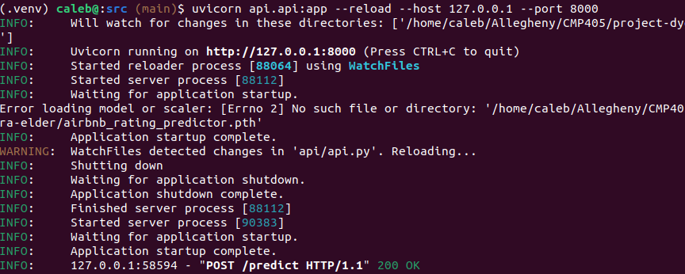
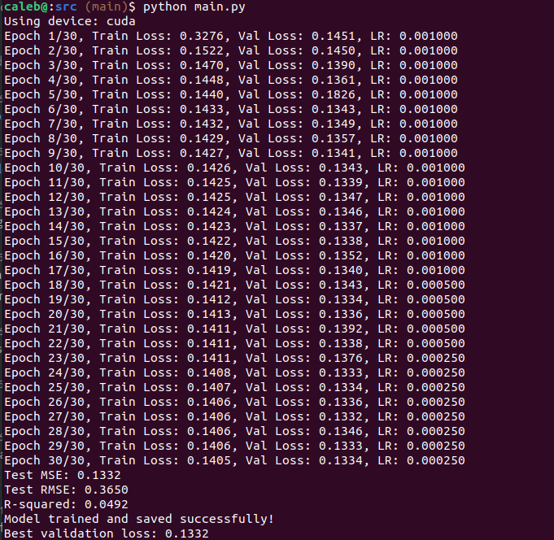

# Final Project Report

## 1. Problem Statement

The domain of this project is the short-term rental market, specifically focusing on Airbnb listings in the USA. The problem we aim to address is predicting the rating of an Airbnb listing based on its features. By leveraging data such as the number of bathrooms, bedrooms, beds, amenities, and price per night, we seek to develop a machine learning model that can provide accurate and reliable predictions of ratings. This can help hosts optimize their listings and improve guest satisfaction while providing valuable insights into factors that influence ratings.

## 2. Data Collection and Preparation

- **Describe your dataset, including its source, size, and features.**  
  - We got our AirBnb data from this website: [https://insideairbnb.com/get-the-data/]. It was 290,000 rows and had ~80 columns. We only used 230,000 rows from this and <10 columns as the other data was either missing or irrelevant.
- **Summarize key insights from your data exploration (what is your data like?).**
  - We found that the data was mostly complete and had a pretty good distribution of ratings, although most of the ratings were between 4 and 5 stars which may just be a result of the Airbnb data being scewed. Some of the listings did not have a rating or a lot of description and this kind of threw us off.
- **Explain your data cleaning, transformation, and feature engineering steps.**
  - We first combined all CSVs from USA locations. We then removed all data without a rating. We then got rid of all columns not being used. We then cleaned the price column to make it just a numerical value.
- **Explain how you divided your data into training, validation, and test sets.**
  - We had the model break the data into 20% for testing randomly and the other 80% for training. This allowed us to have a good amount of diversity in the model to make sure it is not too attached to the data its trained on.

## 3. Model Architecture and Implementation

- **Describe your neural network architecture, including layer types, sizes, and organization.**
  - Here are the hyperparameters used
    ```python
    BATCH_SIZE = 32  # Number of samples per batch
    LEARNING_RATE = 0.001  # Learning rate for the optimizer
    EPOCHS = 30  # Number of training epochs
    TEST_SIZE = 0.2  # Proportion of data to use for testing
    RANDOM_SEED = 42  # Seed for reproducibility
    DROPOUT_RATE = 0.2  # Dropout rate for regularization
    HIDDEN_LAYER_1_SIZE = 128  # Number of neurons in the first hidden layer
    HIDDEN_LAYER_2_SIZE = 64  # Number of neurons in the second hidden layer
    HIDDEN_LAYER_3_SIZE = 32  # Number of neurons in the third hidden layer
    ```
  - Here are the layers used
    ```python
    nn.Linear(input_dim, hidden_size_1),
    nn.ReLU(),
    nn.Dropout(dropout_rate),
    nn.Linear(hidden_size_1, hidden_size_2),
    nn.ReLU(),
    nn.BatchNorm1d(hidden_size_2),
    nn.Linear(hidden_size_2, hidden_size_3),
    nn.ReLU(),
    nn.Linear(hidden_size_3, 1)
    ```
- **Document how you implemented your model (include pseudocode or key code snippets).**
  - As shown in the layers above, we created a 4 layer neural network with 3 hidden layers and an output layers. We also incorporated dropout, batch normalization, and relu activation.
- **Explain the mathematical concepts from calculus and linear algebra that underpin your model.**
  - The model uses many different mathmatical concepts that reside with many different ideas such as ideas from linear algebra and calculus. This includes ideas such as the chain rule, partial deriviates, matrix operations, multi-dimensional arrays, and more.
- **Describe your loss function, optimizer choice, and any learning rate scheduling.**
  - We used MSE for our loss function as it fits weel with rating prediction, Adam for out optimizer, torch for out learning rate scheduler:
  ```python
  scheduler = torch.optim.lr_scheduler.ReduceLROnPlateau(
      optimizer,
      mode='min',
      factor=0.5,  # Reduce learning rate by half on plateau
      patience=3   # Wait 3 epochs with no improvement before reducing
  )
  ```
- **Detail methods used to prevent overfitting (e.g., dropout, weight decay).**
  - We used dropout to randomly remove some data during training, batch normalization to stabilize training, and early stopping to stop the model before its saved.

## 4. Training Methodology

- **Describe the computational resources used for training.**
  - The biggest resource used during training was Caleb's Nividia GPU which he activated to train most all of the data quickly. Some training was also done with CPUs from other teamates.
- **Document all hyperparameters and their selection process.**
  - Most of the hyperparameters were guided by need to be through and make sure that the loss and model is as accurate as possible. as well as through trial and error.
    ```python
    BATCH_SIZE = 32  # Number of samples per batch
    LEARNING_RATE = 0.001  # Learning rate for the optimizer
    EPOCHS = 30  # Number of training epochs
    TEST_SIZE = 0.2  # Proportion of data to use for testing
    RANDOM_SEED = 42  # Seed for reproducibility
    DROPOUT_RATE = 0.2  # Dropout rate for regularization
    HIDDEN_LAYER_1_SIZE = 128  # Number of neurons in the first hidden layer
    HIDDEN_LAYER_2_SIZE = 64  # Number of neurons in the second hidden layer
    HIDDEN_LAYER_3_SIZE = 32  # Number of neurons in the third hidden layer
    ```
- **Explain your training methodology, including batch size, epochs, and early stopping criteria.**
  - As stated above, most of the hyperparameters were guided by need to be through and make sure that the loss and model is as accurate as possible. as well as through trial and error. Epochs were run until they did not have an effect anymore. And batch size was increased until an upper limit of effectiveness was reached.
- **Discuss any challenges encountered during training and how you addressed them.**
  - Learning rate tuning was probably the hardest part. Before we used a learning rate scheduler our learning rate was all over the place, and so over time we used one to be able to make sure our model was being as efficient as possible
- **Analyze the computational requirements of your model (time, memory).**
  - It takes ~5 minutes to get to the best loss possible of ~0.1406 loss rate. It does take a GPU to get this speed, however even with a CPU it would not take a lot of time.

## 5. Evaluation and Results

- **Define and justify the metrics used to evaluate your model.**
  - The model was mostly evaluated using seperate testing data with MSE testing. We used this as it was the same MSE that we used during training and thus it made the most sense to use the same method of evalutation during the testing stage in order to get the most congruent results.
- **Analyze your model's performance across all metrics.**
  - Through the tests that we ran, we found the the performance of the model was overall pretty good, although it did get stuck between 0.13-0.14 loss. This shows that potentially the data given was not enough to be able get a perfect reading on every input, but it was still quite good. In the future, more data could be added to see if the model got more accurate over time.
- **Document experiments that isolate the impact of different model components.**
  - We ran tests to make sure that different features had different weights when predicting the value. We found that the features that had the most impact on the prediction was to increase the amount of rooms, price, or amenities. Increaing these values allowed for more rating overall.
- **Include relevant visualizations of model behavior.**






- **Identify and analyze cases where your model performs poorly.**
  - The biggest problem is that most ratings in the data are between 4.3 and 5 and so the model is very scewed in that even the worst place with no beds or rooms still gets a high rating.

## 6. Ethical Considerations and Social Impact

We identified potential biases in our data, such as the skewed distribution of Airbnb ratings, where most ratings fall between 4 and 5 stars. This could lead to over-optimistic predictions and reduced sensitivity to lower ratings. Privacy concerns were addressed by ensuring that no personally identifiable information was included in our model training, as we only used aggregated and anonymized data. Regarding computational resources, we tried to minimize energy consumption by training the model on a GPU instead of a CPU when possible. In terms of misuse, our model is unlikely to pose significant ethical risks. It does not make decisions about individuals or recommend actions that could directly harm users.

## 7. Model Deployment

We deployed our model as a RESTful API using FastAPI, allowing users to interact with it through HTTP requests. The API is hosted locally on localhost at port 8000, and users can send POST requests with JSON payloads containing features such as the number of bathrooms, bedrooms, beds, amenities, and price per night to receive predicted ratings. To optimize the deployment, we utilized model quantization to reduce the model's size and improve inference speed without significantly compromising accuracy. Additionally, we implemented error handling to ensure a robust and user-friendly interface.

## 8. References

- [Pytorch](https://pytorch.org/)
- [Inside Airbnb](https://insideairbnb.com/get-the-data/)
- GitHub Copilot
